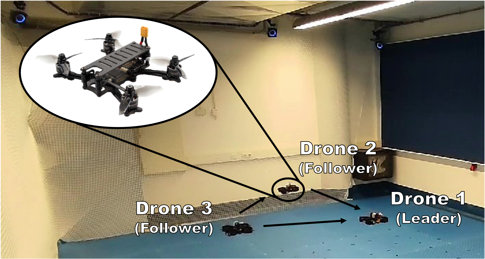
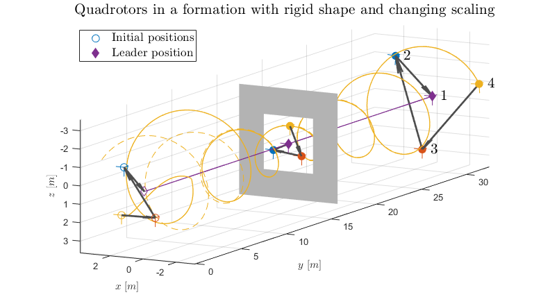

# bpe_quadrotor_formation
**_Code will be released upon paper acceptance_**

# Leader-follower formation tracking control of quadrotor UAVs using bearing measurements
This repository was used to perform the experiments discussed in _"Leader-Follower Formation Tracking Control of Quadrotor UAVs Using Bearing Measurements"_. 
The theory in this paper concerns the formation tracking problem of a group of quadrotor UAVs under a limited sensing graph topology.
Agents only have access to bearing measurements, as well as relative velocity with respect to other agents.
Besides that, they have access to their own attitude.
Using persistence of excitation, as little as one neighbor is required for each follower drone to still attain the desired formation.

## Numerical results
The convergence of the system from numerical simulations in MATLAB can be seen in the figure below, where each following drone only has one neighboring agent, and where the formation shape is rescaled to fit through a window.

## Experimental results
A video of an experiment performed using this repository can be found at [youtu.be/-cPlcVHDzzU](https://youtu.be/-cPlcVHDzzU).

## Installation
This repository relies on the [Pegasus GNC project](https://pegasusresearch.github.io/pegasus/index.html).
For the installation of this simulator environment, see [https://pegasusresearch.github.io/pegasus/source/setup/installation.html](https://pegasusresearch.github.io/pegasus/source/setup/installation.html)
